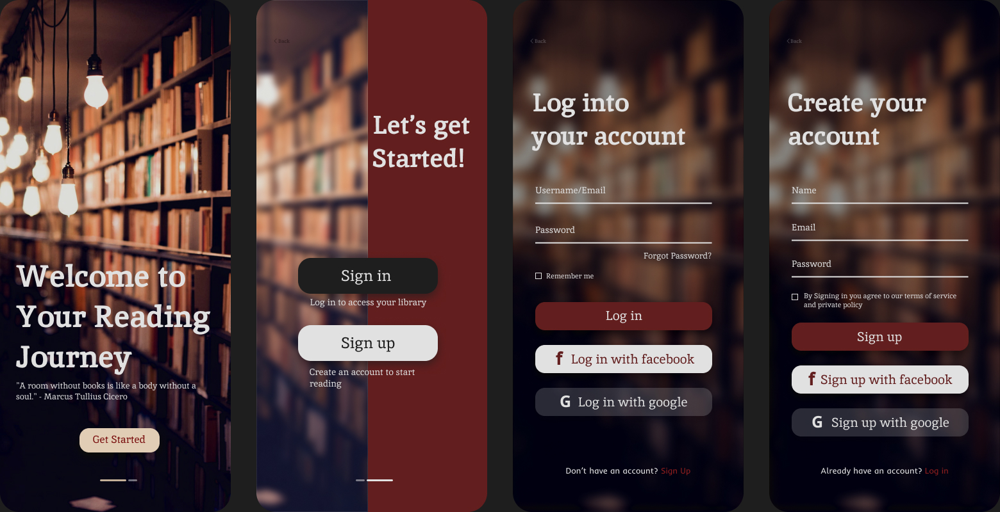

# CODSOFT

## CodSoft Internship - UIUX tasks

Welcome to the repository for my UI/UX internship tasks at CodeSoft. In this repository, I have included the deliverables for Task 1, Task 2 and Task 4, including an image for each task.

## Task 1: Mobile App SignUp Flow

### Task Description
For Task 1, I designed a mobile app signup flow. The goal was to create an intuitive and user-friendly experience for new users registering on the app.

### Image Preview

## Task 2: Email Template

### Task Description
Task 2 involved designing an email template. The objective was to create an engaging and visually appealing template for various communication purposes.

### Image Preview

## Task 4: E-commerce Website

### Task Description
Task 4 focused on designing an e-commerce website using Figma. The goal was to create an immersive and user-friendly online shopping experience.

### Image Preview

## Technologies Used
- Figma: Used for the design and prototyping of all tasks.

## How to View

### Mobile App Signup Flow (Task 1)
To view the full mobile app signup flow, please follow this [link](https://www.figma.com/proto/hsf7h2F8RpR3RqxOKCyzPs/Mobile-App?page-id=0%3A1&type=design&node-id=2-9&viewport=244%2C303%2C0.47&t=aRyiKQ62mV9MkJg8-1&scaling=scale-down&starting-point-node-id=2%3A9&mode=design)

### Email Template (Task 2)
To view the email template, please follow this [link](https://www.figma.com/proto/AFfv6JIIcgYOclNWrQEcUF/Email-Template?page-id=0%3A1&type=design&node-id=3-4&viewport=503%2C-724%2C1.5&t=S0ymZJesrpWCJRoa-1&scaling=scale-down&mode=design)

### E-commerce Website (Task 4)
To view the E-commerce Website, please follow this [link](https://www.figma.com/proto/ULckUzo9bx3p3IU2k5SnNB/E-Commerce-Website?page-id=0%3A1&type=design&node-id=2-2&viewport=232%2C235%2C0.25&t=iXO7pVtl0cUvdonK-1&scaling=scale-down-width)

## About Me

Greetings! I'm Qamreen, currently pursuing a Bachelor's in Computer Science and Design. As a dedicated UI/UX intern at Codsoft, I've had the privilege of working on impactful projects like mobile app sign-up flows, email templates, and e-commerce websites.

In the realm of technology and design, I find the perfect convergence of my academic pursuits. Beyond coding algorithms, I'm passionate about crafting seamless and user-centric digital experiences. 

As I navigate the exciting intersection of Computer Science and Design, my goal is to bridge the gap between functionality and aesthetics, creating solutions that are both efficient and visually compelling.

Let's connect and explore the boundless possibilities at the crossroads of code and creativity!

